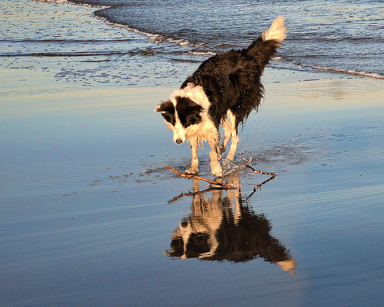

# DeepLearningCaptionGenerator
This deep learning application will be able to utilize a RNN LSTM model for the Flicker8k_Dataset and the Flickr8k_text to generate a new description for a given image. The validation loss was attempted to be reduced through several methods including changing from VGG16 to 
InceptionV3, changing the LSTM to 512, changing the adam optimizer to sgd, lowering the adam learning rate, and changing the dropout size. Details can be seen in the  
paper Mammarelli-generating-image-captions.pdf

Generated Description: "startseq dog is running through the water endseq"

## Order to Run:

### prepare_photo_data.py
Extracts features from dataset using either VGG-16 or InceptionV3

### prepare_text_data.py
Preprocesses text into a clean text file descriptions.txt

### load_data.py
Loads the list of files to open in memory

### def_model.py
Creates the RNN LSTM Model and feeds all of the training photos in. This script requires an extensive amount of RAM (upwards of 44GB) in order to run since all photos are loaded into memory

### eval_model.py
Evaluates the BLEU accuracy of the model by using the test image dataset

### gen_captions.py
Generates a tokenizer.pkl file which will be loaded when generating a new description

### gen_desc_new_photo.py
Generates a new description for a photo

### Note: Models are too large to upload, Flicker8k_Dataset and Flickr8k__text have a license not to distribute so was not uploaded. A request can be sent to https://forms.illinois.edu/sec/1713398 for the dataset.

### Reference: https://machinelearningmastery.com/develop-a-deep-learning-caption-generation-model-in-python/